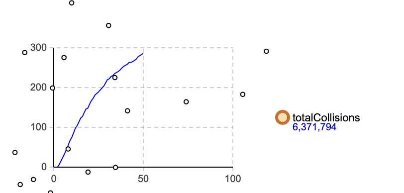
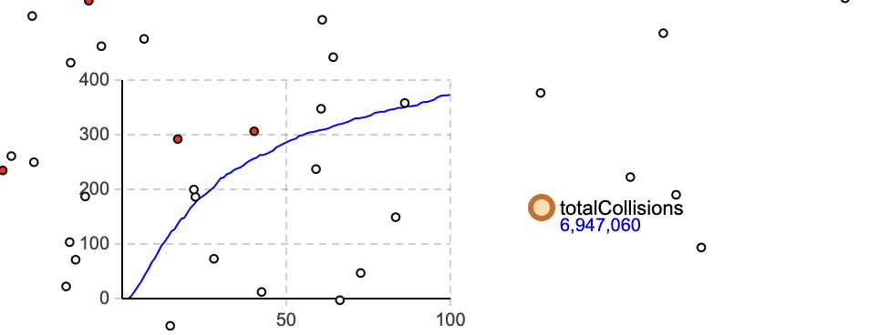
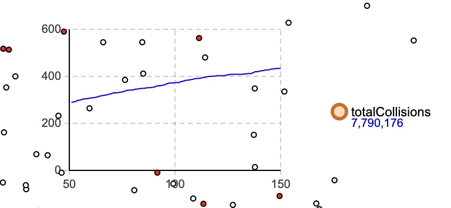
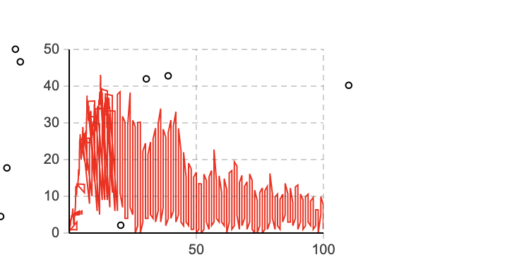
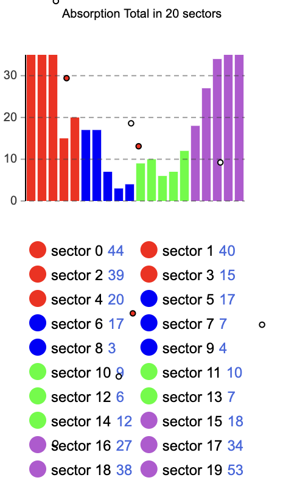
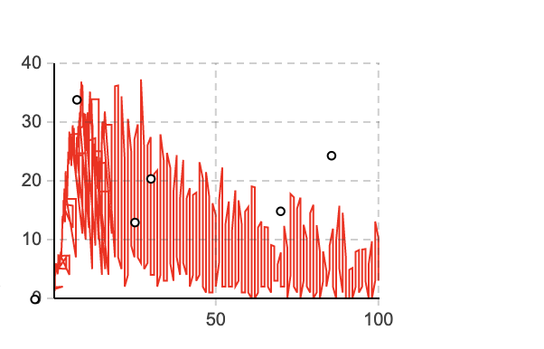
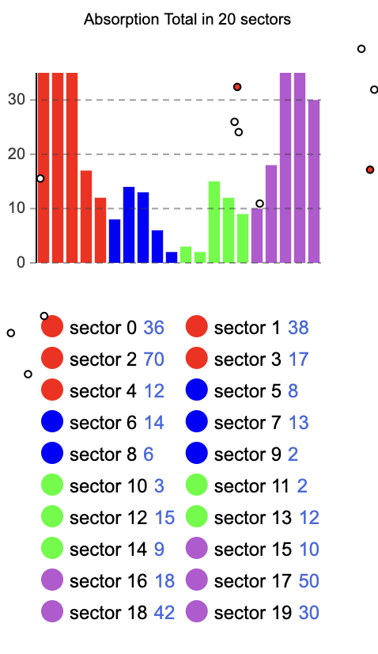
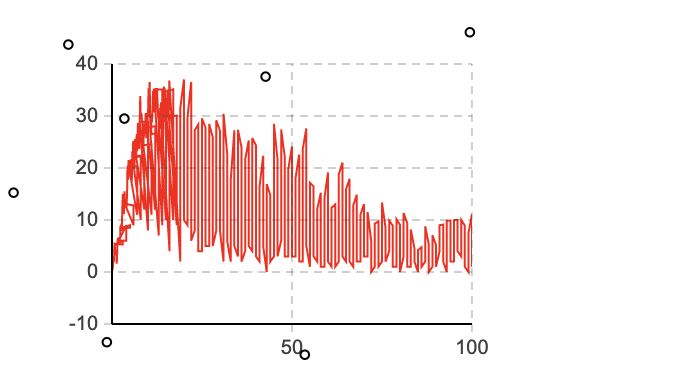
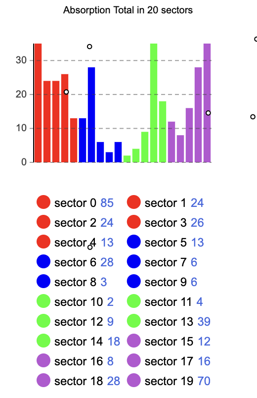

# NanoCommSim — Molecular Communication Simulation (AnyLogic)

A simulation of **diffusion-based molecular communication** between a Transmitter and a Receiver, built with AnyLogic. The transmitter emits pulses of molecules that diffuse through the environment; the receiver detects and counts messages using auto-calibrated thresholds.

## ✅ Defaults in this repo
- Feedback is **OFF** by default 🚫
- Receiver sectors = **20** 🧩
- Threshold lines are **ON** 📈

---

## 🔍 What the simulation does

- The **Transmitter** emits a pulse of molecules (`bacteriaPerPulse`)
- Molecules **diffuse** through the environment (Brownian motion)
- The **Receiver** continuously measures:
  - *Molecules in Range* = molecules currently inside the receiver's sensing radius
- The receiver:
  - **auto-calibrates** thresholds on the first pulse
  - **detects messages** using URT/LRT thresholds on subsequent pulses

---

## 🛠️ Auto-Calibration (first pulse only)

As soon as the receiver starts seeing molecules (`winAbs0 > 0`), calibration begins:

- Collects samples `(tRel, y)` during the first pulse
- Computes `maxY` = peak signal value
- Sets thresholds:
  - `URT = round(0.9 × maxY)`
  - `LRT = round(URT / 3)`

Console output:
```
CALIBRATION START ...
CALIBRATION DONE ... URT=X LRT=Y maxY=Z
```

---

## ✅ Message Detection (URT/LRT)

After calibration:
- Signal rises above **URT** → message START detected 🚀
- Signal falls below **LRT** → message END detected ✅
- On END: `NUMBER_OF_MESSAGES_RECEIVED++` 📩

---

## 🧩 Receiver Sectors (default: 20)

The receiver is divided into **sectors** to track spatial distribution of absorbed molecules around the receiver. Default is 20, but configurable (e.g. 8, 36).

Sector absorption data is exported to CSV (`sector_counts_dt.csv`) with time windows.

---

## 📊 Results

### Simulation snapshots (molecule diffusion)

| t = 50s | t = 100s | t = 150s |
|---|---|---|
|  |  |  |

---

### Receiver shape comparison

The simulation was tested with three receiver geometries:

#### 🔵 Circle
| Simulation | Absorption Heatmap |
|---|---|
|  |  |

#### 🟦 Rectangle
| Simulation | Absorption Heatmap |
|---|---|
|  |  |

#### 🔺 Triangle
| Simulation | Absorption Heatmap |
|---|---|
|  |  |

Full heatmap data available in `results/combined_3_heatmaps.xlsx`.

---

## ▶️ How to run

1. Open `nanoCom1_INRANGE_CALIB_PATCHED_v3.alp` in **AnyLogic 8.9+**
2. Run `Main`
3. Default parameters:
   - receiver sectors = 20
   - threshold lines = ON
   - feedback = OFF
4. Watch:
   - the *Molecules in Range* plot 📈
   - URT/LRT threshold lines
   - console logs for calibration and detection events

---

## 🚫 Feedback (OFF by default)

Feedback logic (receiver → transmitter) exists in the code but is **disabled by default**. Can be toggled without code changes.

---

## 🗂️ Repository Structure

```
├── nanoCom1_INRANGE_CALIB_PATCHED_v3.alp   # AnyLogic project file
├── sector_counts_dt.csv                     # Sector absorption data (CSV export)
├── results/
│   ├── circle/          # Circle receiver: simulation + heatmap
│   ├── rectangle/       # Rectangle receiver: simulation + heatmap
│   ├── triangle/        # Triangle receiver: simulation + heatmap
│   ├── collisions/      # Simulation snapshots at t=50s, 100s, 150s
│   └── combined_3_heatmaps.xlsx
└── README.md
```

---

## 🛠️ Technologies

- **AnyLogic 8.9** — simulation platform
- **Java** — agent logic, calibration, CSV export
- **Excel / CSV** — results analysis and heatmap visualization

---

## 👤 Author

Pavlos Daratzis 🇬🇷  
Aristotle University of Thessaloniki (AUTH) — Computer Science
